# Proyecto30032025Marketing
 
**Autor**: [Óscar Pacheco Fernández]  
 
## 📌 Descripción  
Breve descripción del proyecto. Explica su propósito, funcionalidades principales y cualquier información relevante que los usuarios deban conocer antes de empezar.  
 
Ejemplo:  
*"Este proyecto es un análisis de datos para un [departamento de marketing]. Permite [limpiar datos], [analizar datos] y está construido con [python y diferentes librerías]."*  
 
## 🚀 Características  
- **Característica 1**: Lectura del archivo.  
- **Característica 1**: Limpieza de datos.  
- **Característica 1**: Análisis de datos.  
 
## 🛠️ Tecnologías Utilizadas  
- Lenguaje: [Python]  
- Frameworks/Librerías: [Pandas, Numpy, Matplotlib, Seaborn]  
 
## 📦 Instalación  
Pasos para instalar y configurar el proyecto localmente:  
 
1. Clona el repositorio:  
git clone https://github.com/pachecoofdzz/Proyecto30032025Marketing
 
Al observar los archivos aparecen algunos errores pero al descargarlo en local y ejecutarlo funciona de manera correcta
 
 
# ¿CÓMO HE LIMPIADO LOS DATOS?
 
1. **Importo todas las librerías**  
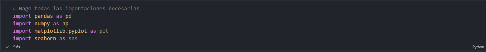
2. **Cargo los datos**  
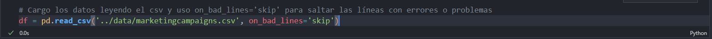
3. **Muestro las primeras filas del DataFrame**  
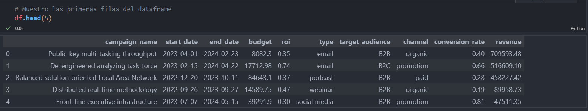
4. **Muestro información del DataFrame**  
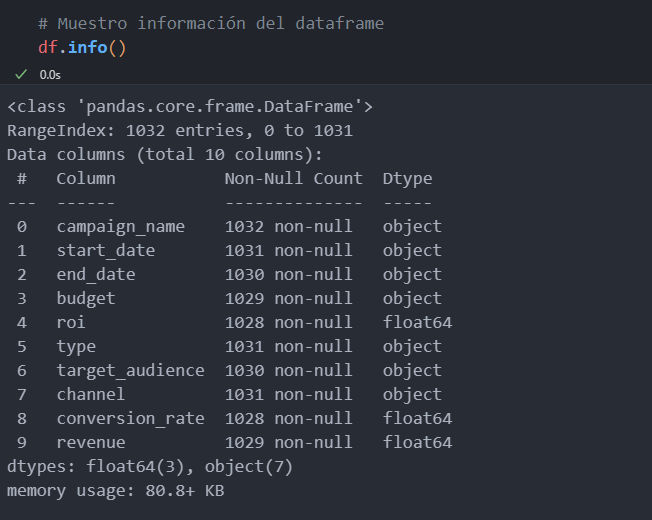
5. **Muestro estadísticas descriptivas del DataFrame**  
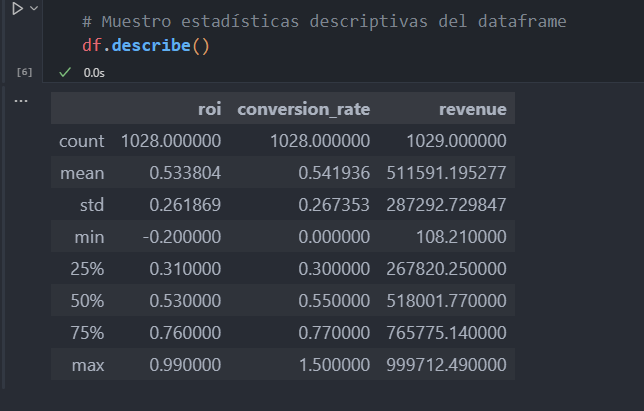
6. **Elimino filas con valores NaN (Not a Number)**
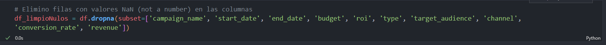
7. **Elimino filas duplicadas en el DataFrame**  

8. **Muestro cantidad de filas y columnas del DataFrame limpio**
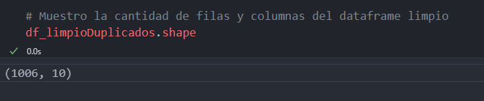  
9. **Corrijo formato de fechas**
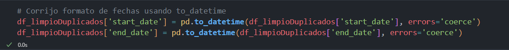  
10. **Paso los campos que deberían ser numéricos a `float`**  
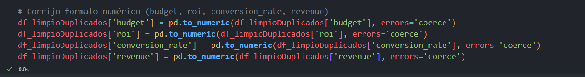
11. **Los campos de texto los paso a minúscula y quito espacios de principio y fin** 
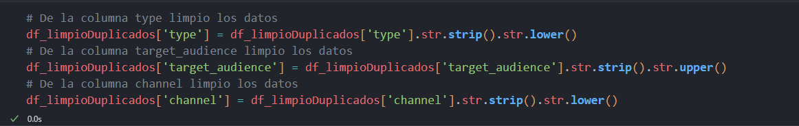 
12. **Compruebo los valores únicos**  
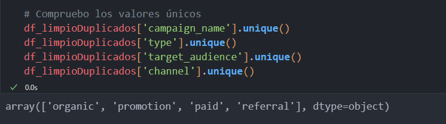
13. **Manejo valores atípicos usando cuartiles**  
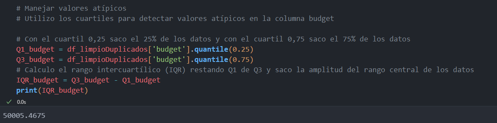
14. **Creo la columna `DuracionCampaña` que es `End_Date` menos `Start_Date`**  
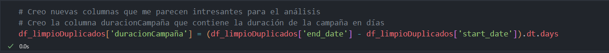
15. **Creo la columna `ROIajustado` que es `ROI` menos `DuracionCampaña`**  
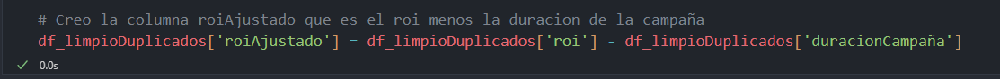
16. **Creo la columna `EficienciaCosto` que es `Revenue` menos `Budget`**  
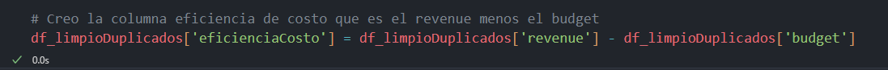
17. **Verifico las columnas creadas anteriormente**  
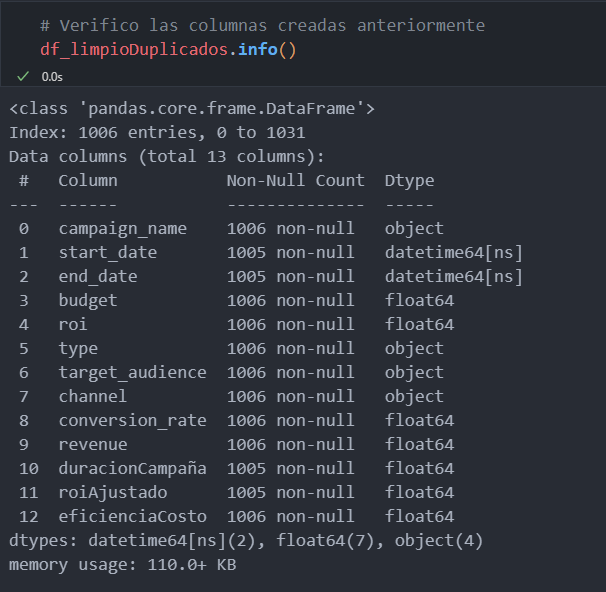
18. **Creo la columna `EstacionInicio` que es el `Quarter` de `Start_Date`**  
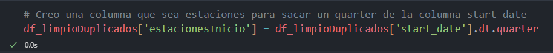
19. **Creo la columna `MesInicio` que es el mes de `Start_Date`**  
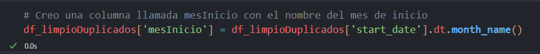
20. **Creo la columna `ROIdiario` que es `ROI` dividido entre `DuracionCampaña`** 
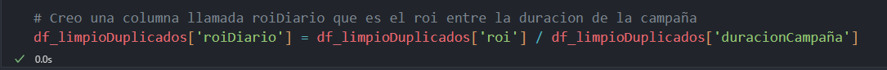 
21. **Compruebo los valores nulos de las nuevas columnas**  
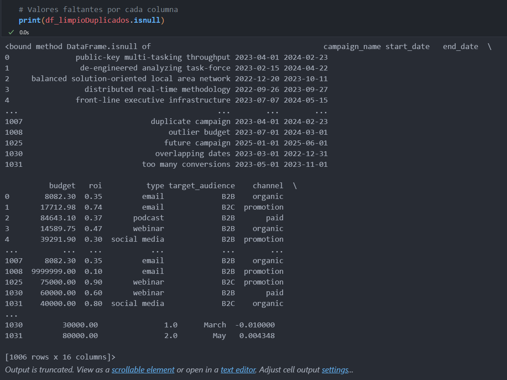
22. **Compruebo los tipos de datos de las nuevas columnas**  
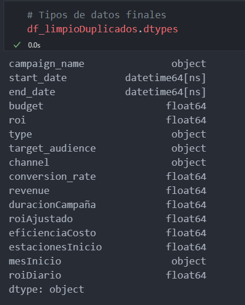
23. **Saco la media de todas las columnas numéricas**  
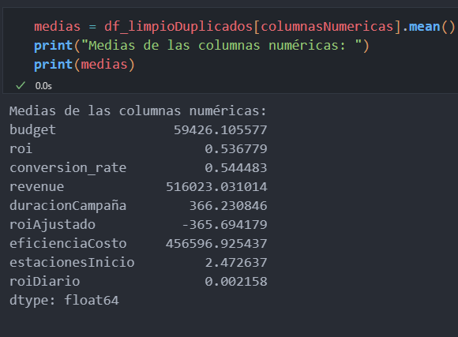
24. **Saco la mediana de todas las columnas numéricas**  
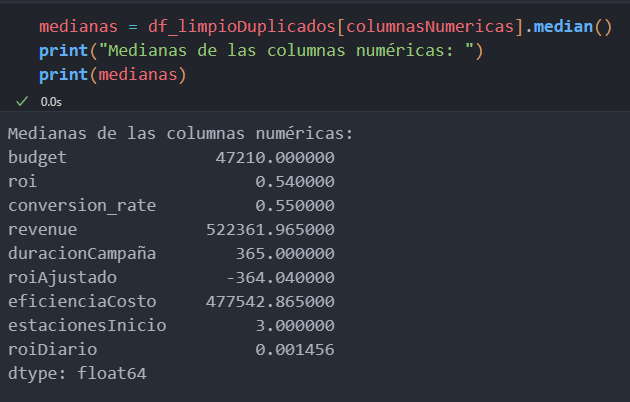
25. **Exporto el DataFrame y lo paso a CSV**
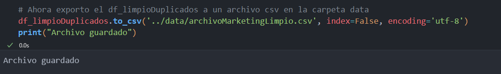